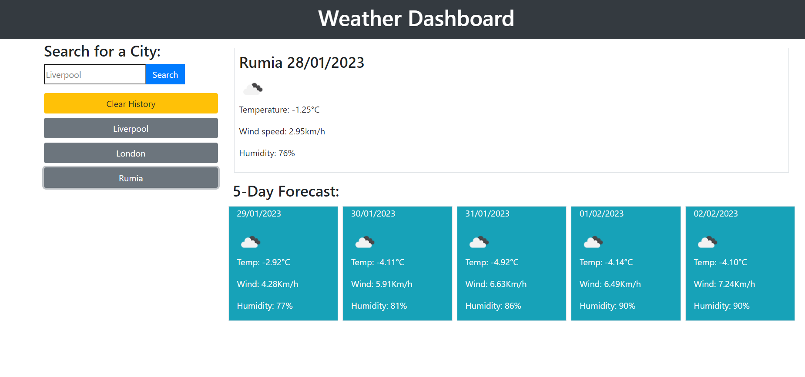

## Table of contents

- [Overview](#overview)
  - [The challenge](#the-challenge)
  - [Screenshot](#screenshot)
  - [Links](#links)
- [Author](#author)

## Overview

### The challenge

* Nice and simple weather dashboard.
* When creating it I have learned how to fetch data from APIs, append/prepend it to page and how to set/get/remove local storage items

### Screenshot

### Links

* You can see deployed weather dashboard here: https://skwiera-magic.github.io/weather-dashboard

## Author
- Skwiera-Magic - [My GitHub](https://github.com/Skwiera-Magic/)